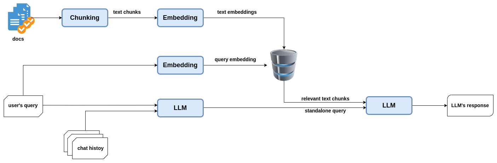
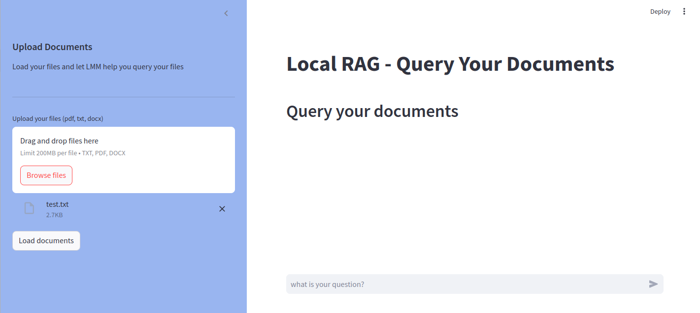

# Retrieval Augmented Generation (RAG)

I found it tedious and time-consuming to search for information within my local files. So, I developed this project using **Retrieval Augmented Generation (RAG)** to simplify the process. By leveraging **LangChain**, **Chroma**, and **ChatGPT**, it allows users to query their local files with relevant document snippets provided as context.

## Workflow
The following flowchart illustrates the project workflow.
The text from input documents is extracted and chunked into smaller passages. Embedding vectors for these chunks are generated and stored in a vector database, in this case, Chroma. 

When a user submits a query, it is converted into a standalone query based on the chat history. Relevant text passages are retrieved from the vector database as context. The standalone query and the retrieved context are sent to the LLM, which generates a response based on the provided context.



## File Formats
I chose to allow uploading multiple file types, including **PDF**, **TXT**, and **DOCX** formats. These files are chunked into smaller sections, vectorized, and stored for efficient retrieval during queries.

## Vector Database
The project uses **Chroma** as the vector database for storing text embeddings. Chroma efficiently handles vectorized representations of text chunks and allows for quick and accurate retrieval.

## Requirements
It is recommended to set up a Python environment before running the project. You can install the required dependencies using:
```bash
pip install -r requirements.txt
```

## Running the App
To start the app, simply use the following command:
```bash
streamlit run app.py
```



## OpenAI API Key
An OpenAI API key is required to use ChatGPT. Save the key in a file named `.streamlit/secrets.toml` as shown below:
```toml
openai_api_key = "YOUR_API_KEY"
```
If the file is missing, the app will prompt you to enter the key each time it runs.
